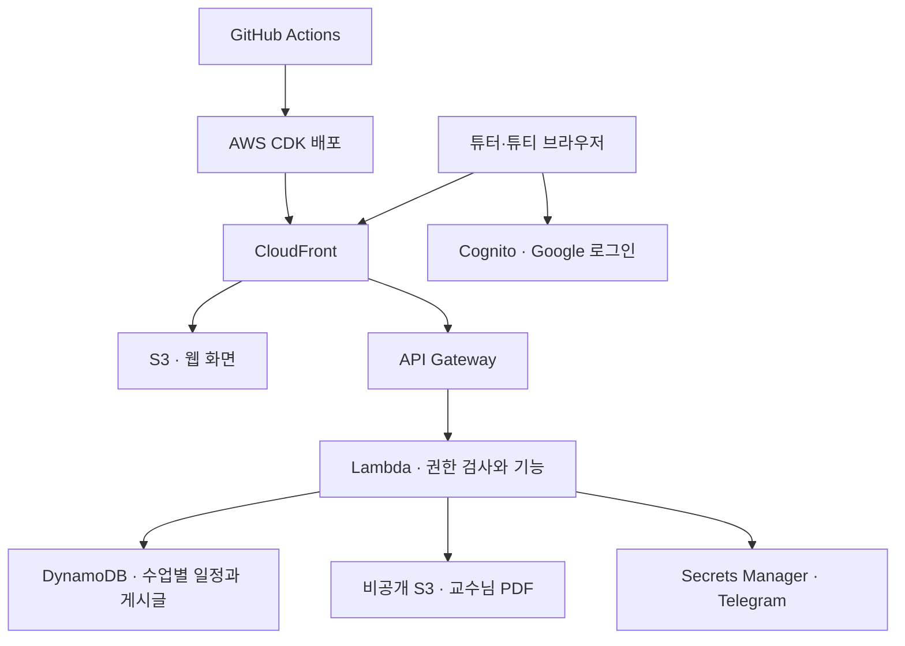

# 자료구조 튜터링

**Data Structures Peer Tutoring** is a private learning hub for small tutoring groups. Students explain assigned topics, the tutor clarifies key concepts, and each meeting ends with questions. The site includes a weekly map, notices, private materials, attendance, reports, Q&A, and concept quizzes. Built with React, TypeScript, and AWS CDK.

Site: https://d1nhri0xudbp4k.cloudfront.net/

여러 튜터가 각자 수업 공간을 만들고, 공간마다 튜티 최대 5명이 쓰는 자료구조 튜터링 웹사이트입니다. React·TypeScript 화면, Cognito Google 로그인, API Gateway·Lambda, DynamoDB, 비공개 S3 자료 저장소, CloudFront를 AWS CDK로 배포합니다.

## 서비스 미리 보기

실제 수업 공간은 가입한 팀원만 열 수 있어, 아래 화면은 **샘플 데이터**로 촬영했습니다. 학생 정보와 교수님 자료는 포함하지 않았습니다.


지도에서 주차 선택 → 게시판에서 공지와 PDF 확인 → 주차 자료 열람 → 보고서 작성 → 개념 퀴즈 풀이

| 탐험 지도 | 공지 게시판 | 모바일 화면 |
| :---: | :---: | :---: |
| [](docs/media/adventure-map.png) | [](docs/media/notice-board.png) | [](docs/media/mobile-map.png) |

<details>
<summary>PDF 뷰어·주차 자료·보고서·퀴즈 화면 보기</summary>

### 공지 PDF 뷰어


### 주차별 자료


### 학습 보고서


### 개념 퀴즈


</details>

## 우리 서비스의 구조



첫 튜터 계정은 전체 수업을 관리하는 운영자입니다. 새 튜터의 수업은 같은 10주 자료구조 형식으로 시작하며, 가입코드·튜티·자료·공지·보고서·질문·퀴즈·로그는 수업 공간별로 분리됩니다. 기존 수업은 기존 DynamoDB 키를 그대로 사용합니다. 새 수업에는 수업 ID를 붙인 별도 키를 사용하므로 기존 데이터 이전이 필요하지 않습니다.

화면은 React·TypeScript로 만들고 S3에 정적 파일로 올립니다. CloudFront가 화면을 전달하고 API 요청을 API Gateway로 보냅니다. Cognito가 Google 로그인 토큰을 발급하며, API Gateway와 Lambda가 로그인과 튜터·튜티 권한을 검사합니다. 일정과 게시글은 DynamoDB에, 교수님 PDF는 별도의 비공개 S3 버킷에 저장합니다. PDF는 권한 검사 후 짧게 유효한 다운로드 링크로 제공합니다. AWS CDK가 이 자원들을 코드로 관리합니다.

### EC2·Harbor·쿠버네티스·파드는 언제 쓰나?

| 도구 | 주로 쓰는 경우 | 이 사이트 |
| --- | --- | --- |
| [EC2](https://docs.aws.amazon.com/AWSEC2/latest/UserGuide/concepts.html) | 운영체제와 서버 프로그램을 직접 설치·관리하는 가상 서버가 필요할 때 | 웹은 S3·CloudFront, 서버 기능은 Lambda에서 실행하므로 EC2 인스턴스를 만들지 않습니다. |
| [Harbor](https://goharbor.io/) | 직접 만든 컨테이너 이미지를 보관하고 접근 권한·스캔을 관리할 때 | 배포할 컨테이너 이미지가 없어 사용하지 않습니다. |
| [쿠버네티스](https://kubernetes.io/docs/concepts/) | 여러 컨테이너 서비스를 계속 실행하면서 배포·확장·복구를 직접 제어할 때 | 서버 기능을 AWS Lambda로 실행하므로 클러스터를 운영하지 않습니다. |
| [파드](https://kubernetes.io/docs/concepts/workloads/pods/) | 쿠버네티스에서 컨테이너를 실행할 때 쓰는 가장 작은 배포 단위 | 쿠버네티스가 없으므로 파드도 만들지 않습니다. |

이 서비스는 웹 정적 파일과 요청이 들어올 때 실행되는 Lambda 함수로 충분합니다. 나중에 상시 실행 서버나 여러 컨테이너 서비스가 필요해지면 그때 컨테이너 플랫폼을 검토하면 됩니다.

## 이미지와 글꼴

지도에는 [Kitbitz Nature Kit](https://kitbitz.art/kits/nature-kit)의 월드 이미지와 [Kitbitz CC0 에셋](https://github.com/CaptExcellent/kits-library-assets)을 사용합니다. 제목과 본문에는 배달의민족 주아체와 한나체 Air를 사용하며, [글꼴 사용 조건](https://www.woowahan.com/fonts/license)과 [라이선스 사본](web/public/fonts/LICENSE.txt)을 함께 제공합니다.

## 로컬 확인

Node.js 22 이상이 필요합니다.

```bash
npm install
npm run dev:demo
```

로컬 미리보기는 `http://127.0.0.1:5173/`에서 열립니다. 예시 데이터로 화면을 확인할 수 있으며 실제 Google 로그인, 파일 저장, Claude API 호출은 하지 않습니다. 이 컴퓨터의 `.local/preview-names.json`에 적은 이름 5개는 **로컬 미리보기에서만** 읽습니다. 이 파일은 Git에서 제외되고 배포 파일에 포함되지 않습니다. 학번과 전화번호는 입력하지 않습니다.

```bash
npm run typecheck
npm test
npm run build
npm run synth
```

## AWS 배포 준비

1. `ap-northeast-2` 리전의 AWS 계정을 준비하고 로컬에 AWS CLI 인증을 설정합니다. CDK가 사용할 권한에는 CloudFormation, IAM, S3, CloudFront, Lambda, API Gateway, Cognito, DynamoDB, Secrets Manager, Budgets가 포함되어야 합니다.
2. Google Cloud Console에서 OAuth 동의 화면을 **External**로 설정하고 **웹 애플리케이션** OAuth 클라이언트를 만듭니다. 학교와 개인 계정이 섞여 있으므로 Internal로 설정하면 외부 계정이 막힐 수 있습니다. 승인된 리디렉션 URI로 `https://ryeong-ds-tutoring-2026.auth.ap-northeast-2.amazoncognito.com/oauth2/idpresponse`를 등록합니다. Google Client ID와 Client Secret을 받습니다. 이 앱은 기본 로그인 범위(`openid`, `email`, `profile`)만 사용하며, [Google 정책상 이 범위만 쓰는 앱은 Testing 모드의 테스트 사용자 제한에서 제외될 수 있습니다](https://developers.google.com/identity/protocols/oauth2/production-readiness/overview).
3. AWS Secrets Manager에 Google Client Secret과 Telegram 봇 설정을 각각 비밀로 저장합니다. Telegram 비밀은 `{"botToken":"봇 토큰","chatId":"개인 채팅 ID"}` 형식입니다. 비밀은 코드나 `.env`에 넣지 말고 각 비밀의 **전체 ARN**만 사용합니다.
4. 이미 준비한 `.env`에 Google Client ID와 두 비밀 ARN을 입력합니다. 튜터 이메일, 튜터명, 도메인 접두사, PDF 폴더 경로, 비용 알림 이메일은 로컬 설정에 반영합니다. `.env`, `.local/`, `cdk-outputs.json`은 Git에서 제외됩니다.

현재 Telegram 알림은 기존 수업의 박세령 튜터에게만 보냅니다. 다른 튜터 수업의 학생 활동을 기존 봇으로 전달하지 않아 공간 간 정보가 섞이지 않습니다. 새 튜터별 Telegram 알림은 별도 봇 설정 후 연결해야 합니다.

Telegram 채팅 ID는 새 토큰으로 봇에게 `/start`를 보낸 후 이 프로젝트에서 `npm run telegram:chat-id`로 확인할 수 있습니다. 터미널에서 토큰을 숨겨 입력하며, 화면에는 채팅 ID만 출력합니다. 채팅 ID와 토큰을 Secrets Manager에 등록한 뒤에는 사이트가 튜티의 가입, 참석 응답, 질문·답글, 보고서 제출, 진도 기록, 퀴즈 제출을 튜터에게 알립니다. 알림 본문에는 보고서·질문 내용과 퀴즈 답안을 넣지 않습니다.

```bash
npx cdk bootstrap aws://<AWS_ACCOUNT_ID>/ap-northeast-2
npm run deploy
```

첫 배포 후 CDK 출력의 `SiteUrl`을 `.env`의 `APP_URL`로 입력하고 다시 배포합니다. CDK가 Cognito 앱 클라이언트의 콜백·로그아웃 URL과 PDF 업로드 허용 출처를 CloudFront 주소로 바꿉니다. Google Cloud Console의 승인된 리디렉션 URI는 위의 Cognito `/oauth2/idpresponse` 주소를 그대로 사용합니다.

```bash
# .env에 APP_URL=https://<CloudFront 도메인> 입력
npm run deploy
```

첫 배포의 콜백은 로컬 주소이고, 두 번째 배포 후 CloudFront 주소에서 Google 로그인을 사용할 수 있습니다. CDK 출력과 CloudFront 배포 완료를 확인한 뒤 사이트에 접속하세요.

배포 명령은 로컬 자료구조 PDF를 비공개 S3 버킷으로 가져옵니다. 튜티 이름·학번·전화번호 명단은 배포 파일에 넣거나 일괄 업로드하지 않습니다. 참가자는 직접 Google 계정과 가입코드로 가입하며, 사이트에는 가입에 필요한 계정 이메일과 표시 이름만 보관합니다. 나중에 자료를 다시 가져오려면 `npm run import:local`을 실행합니다.

### CI/CD

`.github/workflows/deploy.yml`은 Pull Request에서 타입 검사·테스트·웹 빌드를 실행합니다. `main`에 푸시하면 같은 검사를 통과한 뒤 AWS CDK로 사이트를 자동 배포합니다. GitHub Actions는 이 저장소의 `main` 브랜치에만 허용된 AWS OIDC 역할을 사용하며, AWS 장기 액세스 키나 Google·Telegram 비밀값은 GitHub에 저장하지 않습니다. 배포에 필요한 공개 설정과 Secrets Manager ARN은 GitHub Actions 저장소 변수에 있습니다. 교수님 PDF는 GitHub Actions에서 다루지 않고 비공개 S3에 보관하며, 자료를 바꿀 때만 이 컴퓨터에서 `npm run import:local`을 실행합니다.

## 처음 접속한 뒤

1. `TUTOR_EMAIL`과 일치하는 Google 계정으로 로그인합니다. 이 계정은 모든 수업에 접근하는 통합 운영자입니다. **전체 수업 관리**에서 일회용 튜터 초대코드를 발급해 전달합니다. 코드는 7일 동안 유효하며 원문은 발급 직후에만 볼 수 있습니다. 새 튜터가 자신의 Google 계정으로 로그인해 코드·이름·수업 이름을 입력하면 같은 10주 형식의 공간이 만들어집니다. 운영자가 이메일을 미리 받을 필요는 없습니다.
2. 각 수업의 **튜터 전용**에서 가입코드를 발급해 참가자에게 전달합니다. 참가자는 각자 Google 계정으로 로그인한 뒤 코드를 한 번 입력합니다. 최대 다섯 명까지 가입할 수 있습니다.
3. 튜터 전용 명단에서 가입한 튜티의 표시 이름과 권한을 고칠 수 있습니다. 참여하지 않는 튜티는 명단에서 제외해 새 참가자 자리를 만들 수 있습니다. 대표튜티 한 명을 지정합니다. 대표튜티는 공개된 주차의 자료와 도달 페이지를 기록합니다.
4. 다섯 번째 튜티가 가입하면 10회 보고서 담당자가 각 2회씩 자동 배정됩니다. 다섯 명이 확정되지 않아도 튜터가 주차별 담당자를 직접 지정할 수 있습니다.
5. **일정·자료**에서 잠정 날짜와 주제, 장소, 보고서 담당자를 검토한 뒤 각 주차를 공개합니다. PDF는 10MB 이하로 올립니다. **Zoom 모임**에서 링크를, **홈**의 게시판에서 공지를 등록합니다.
6. **개념 퀴즈**에서 주차별 생성 프롬프트를 복사해 튜터 자신의 AI 도구로 5문항 JSON을 만든 뒤 붙여 넣습니다. [HTML 공통 템플릿](web/public/quiz-template.html) 업로드도 가능합니다. 문항·정답·해설을 검토한 뒤 공개하며, 튜티 답안은 서버에서 채점합니다.

출석, 세션 메모, 제출 현황, AI 사용 기록, 활동 로그, 전체 기록 ZIP 다운로드는 튜터에게만 제공됩니다. 튜터는 튜티 화면 미리보기를 사용할 수 있습니다. 사용 중인 계정이 비활성화되면 서버가 매 요청마다 접근을 차단합니다.

### 개인 AI 키

개인 API 키는 사이트에 입력하거나 AWS에 저장하지 않습니다. 각 튜터가 자신의 컴퓨터에서 AI 도구를 사용하고 **생성한 퀴즈 문항만** 사이트로 가져옵니다. 따라서 수업 운영자도 다른 튜터의 키를 사이트에서 조회할 수 없습니다. 서버의 Bedrock 퀴즈 생성 호출은 제거했습니다. 학교에서 제공한 API의 사용 조건과 연결 보안은 각자 확인해야 합니다.

## 운영 비용과 자료 접근

월 AWS 비용 예산은 50 USD이며 실제 지출 10 USD와 50 USD에 이메일 알림을 보냅니다. 예산은 사용을 자동 중지하지 않습니다. 사이트는 AI 호출 비용을 발생시키지 않으며, 이전 생성 기록의 토큰 사용량은 튜터 화면에 남아 있습니다.

자료 버킷은 공개 접근을 차단합니다. 주차 자료 PDF는 로그인·권한 확인 뒤 60초 유효한 링크로, 공지 PDF는 권한 확인 뒤 5분 유효한 뷰어 링크로 제공합니다. DynamoDB의 시점 복구가 켜져 있습니다. 사이트와 자료 버킷, 데이터베이스는 스택 삭제 시 보존하도록 설정했습니다.
