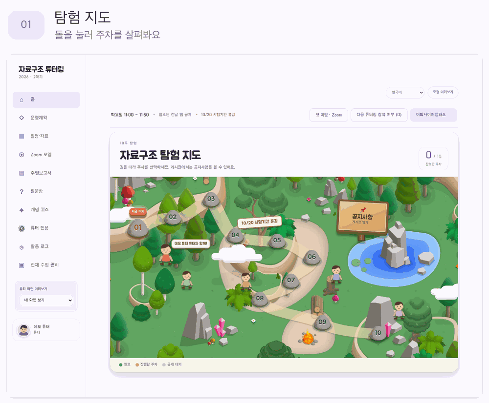
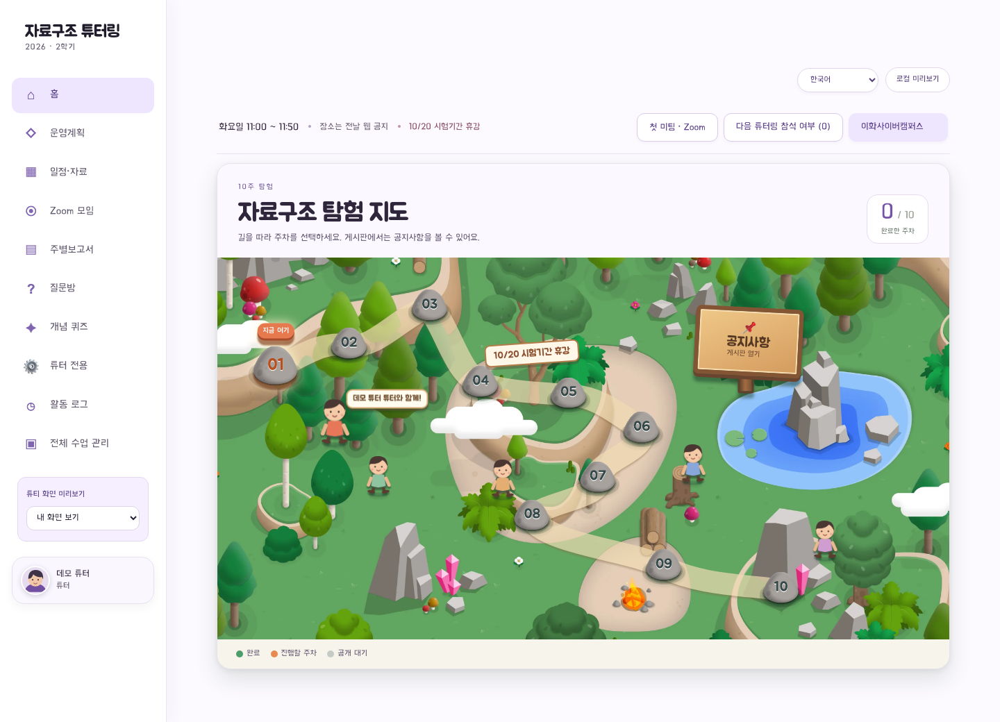
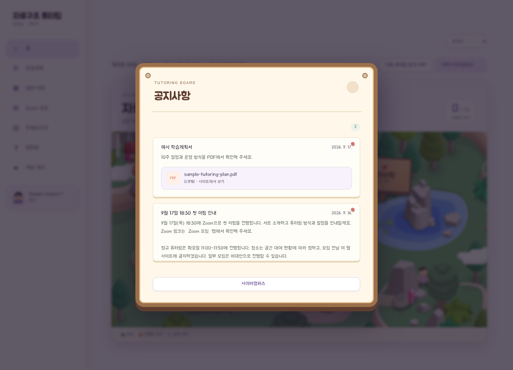
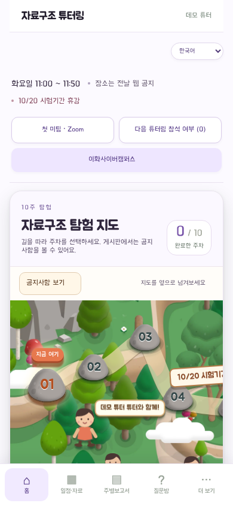
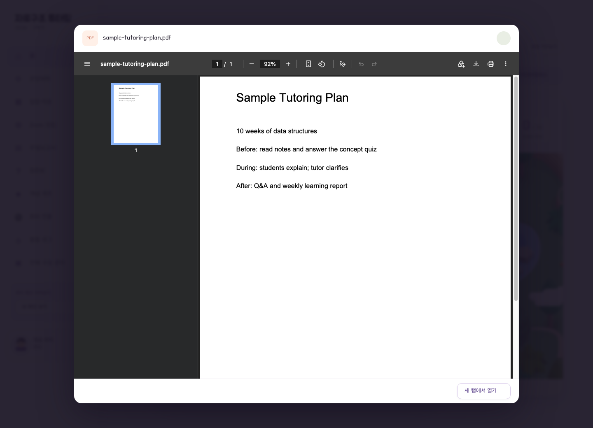
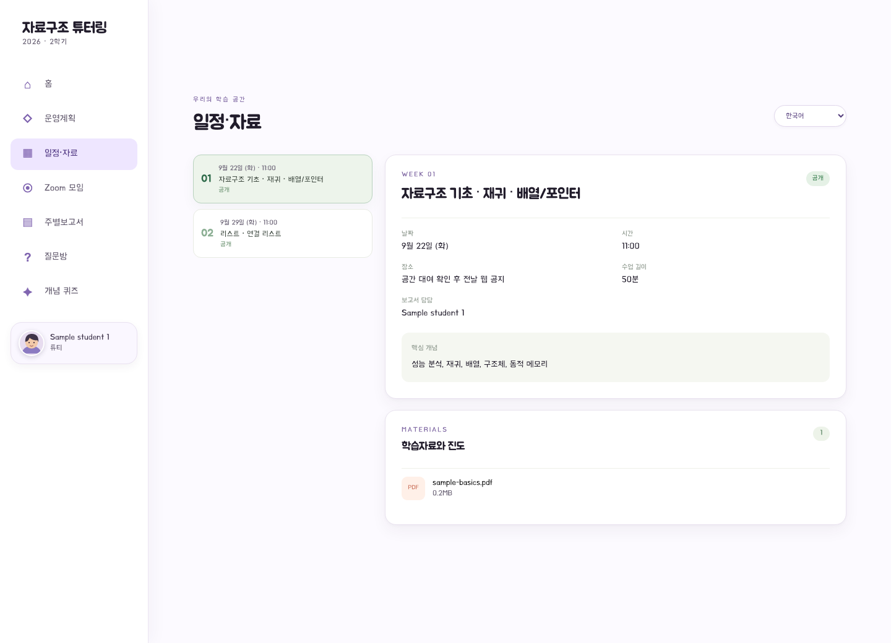
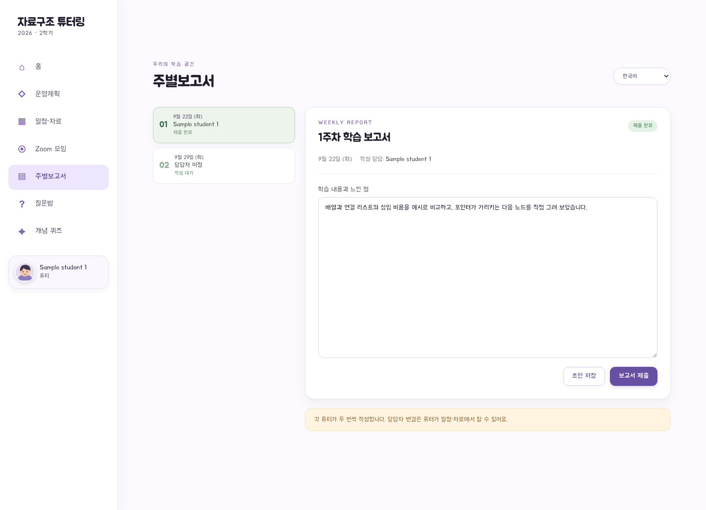
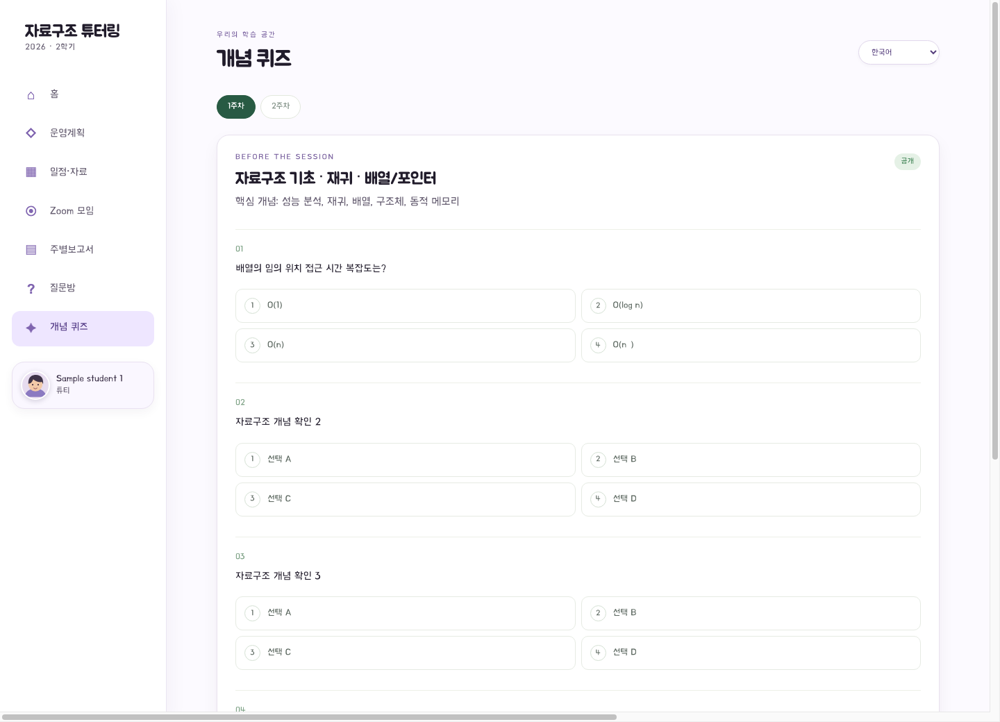
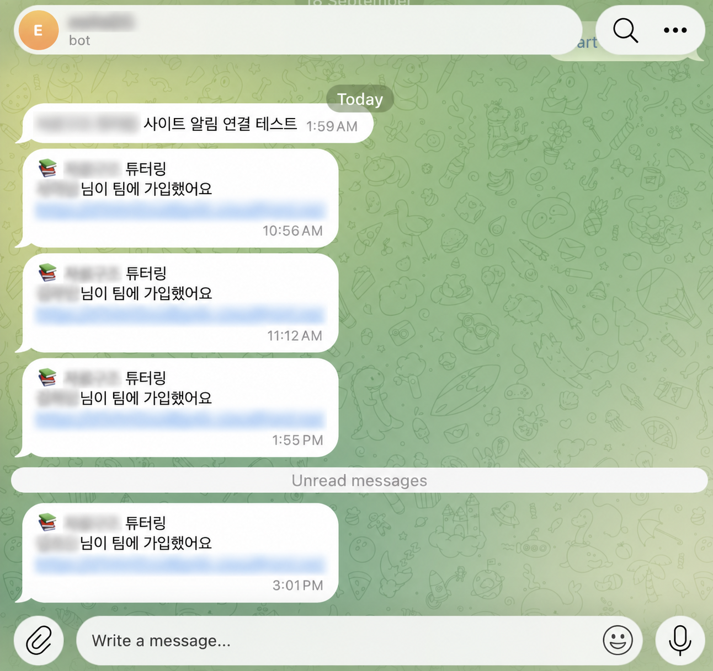
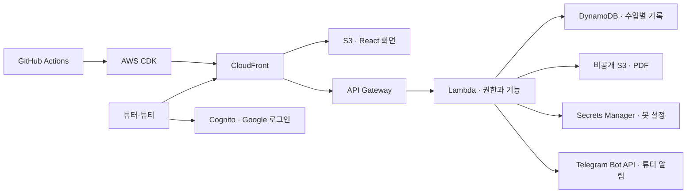

<h1 align="center">자료구조 튜터링</h1>

<p align="center">튜터와 튜티가 한 주씩 함께 나아가는 자료구조 학습 공간<br>주차별 지도에서 자료를 찾고, 서로 설명하고, 질문과 기록을 이어갑니다.</p>

<p align="center"><a href="https://d1nhri0xudbp4k.cloudfront.net/">사이트 열기</a> · <a href="#사용-화면">사용 화면</a> · <a href="#주요-기능">주요 기능</a> · <a href="#빠른-시작">빠른 시작</a> · <a href="#구조와-문서">구조와 문서</a></p>

<p align="center"><a href="https://github.com/ryeong03/data-structures-tutoring/actions/workflows/deploy.yml"></a></p>

---

## 왜 만들었나

작은 튜터링 모임에서도 공지, 자료, 참석 여부, 질문, 보고서가 여러 곳에 흩어지면 다음 모임을 준비하기 어렵습니다. 이 사이트는 **한 주의 진행 상황과 할 일을 한곳에 모으기 위해** 만들었습니다. 각 튜터는 독립된 수업 공간을 쓰고, 참여한 팀원만 해당 공간에 접근합니다.

## 사용 화면

실제 수업 공간은 가입한 팀원만 열 수 있습니다. 아래 GIF와 이미지는 **샘플 데이터**로 촬영했으며 학생 정보와 교수님 자료는 포함하지 않았습니다.



| 탐험 지도 | 공지 게시판 | 모바일 화면 |
| :---: | :---: | :---: |
| [](docs/media/adventure-map.png) | [](docs/media/notice-board.png) | [](docs/media/mobile-map.png) |

<details>
<summary>PDF 뷰어·자료·보고서·퀴즈 화면 더 보기</summary>

### 공지 PDF 뷰어



### 주차별 자료



### 학습 보고서



### 개념 퀴즈



</details>

## 주요 기능

- **주차 지도와 공지:** 10주 지도에서 주차를 열고, 게시판에서 공지와 첨부 PDF를 확인합니다.
- **자료와 진도:** 로그인한 팀원만 수업 자료를 열 수 있습니다. 대표튜티와 튜터가 사용한 자료와 도달 페이지를 기록합니다.
- **참석과 보고서:** 다음 모임 참석 여부를 답하고, 담당 튜티가 보고서를 작성·제출합니다.
- **질문과 퀴즈:** 질문에 답글을 남기고 해결 여부를 표시합니다. 튜터가 5문항 퀴즈를 검토해 공개하면 서버가 답안을 채점합니다.
- **수업별 공간:** 튜터 초대코드로 새 공간을 만들고, 각 공간의 튜티·공지·자료·기록을 분리합니다. 통합 운영자는 전체 수업을 관리합니다.
- **튜터 알림:** 기존 수업에서는 튜티의 가입·참석 응답·질문·보고서 제출 등을 Telegram 봇으로 튜터에게 알립니다.
- **접근 권한:** Google 로그인과 가입코드를 사용하며, 서버에서 튜터·튜티 권한을 확인합니다. 화면은 한국어·영어·러시아어·카자흐어를 지원합니다.

## Telegram 알림

튜티가 가입하거나 참석 여부를 답하고, 질문·답글·보고서·퀴즈 답안을 제출하거나 진도를 기록하면 기존 수업의 튜터에게 알림이 갑니다. 알림에는 활동 종류와 작성자만 담고 질문·보고서 본문과 퀴즈 답안은 보내지 않습니다. 다른 튜터의 수업은 별도 봇 설정이 필요합니다. 연결 방법은 [배포 문서](docs/DEPLOYMENT.md)에 있습니다.

<p align="center"></p>

<p align="center"><sub>공개용 이미지: 봇·학생·서비스 이름과 주소를 블러 처리했습니다.</sub></p>

## 빠른 시작

Node.js 22 이상이 필요합니다. 샘플 데이터로 로컬 화면을 보려면:

```bash
npm install
npm run dev:demo
```

`http://127.0.0.1:5173/`에서 열립니다. 로컬 데모는 실제 Google 로그인·파일 저장·AI 호출을 하지 않습니다. 검사 명령은 `npm run typecheck`, `npm test`, `npm run build`입니다.

## 구조와 문서



| 문서 | 내용 |
| --- | --- |
| [서비스 구조](docs/ARCHITECTURE.md) | 데이터 분리, 접근 권한, AWS 구성과 컨테이너 도구 비교 |
| [AWS 배포와 비용](docs/DEPLOYMENT.md) | Google OAuth, Secrets Manager, CI/CD, 비용 알림 |
| [수업 운영 안내](docs/OPERATIONS.md) | 튜터 초대, 튜티 가입, 자료·보고서·퀴즈 운영 |

## 이미지와 글꼴

지도에는 [Kitbitz Nature Kit](https://kitbitz.art/kits/nature-kit)의 월드 이미지와 [Kitbitz CC0 에셋](https://github.com/CaptExcellent/kits-library-assets)을 사용합니다. 제목과 본문에는 배달의민족 주아체와 한나체 Air를 사용하며, [글꼴 사용 조건](https://www.woowahan.com/fonts/license)과 [라이선스 사본](web/public/fonts/LICENSE.txt)을 함께 제공합니다.
